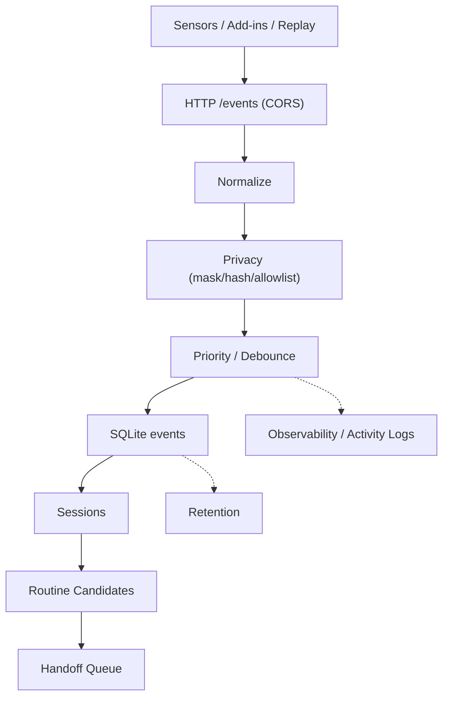

# Interim Report (중간보고서)

## 목차
1. 목적
2. 데이터 아키텍처
3. 실행 프로세스 및 수집 흐름
4. 코어 로그 해석
5. DB 구조 및 저장 방식
6. 리소스 관리/경량화 전략
7. 1차 데이터 수집 요약 및 고찰
8. 2차 데이터 수집 상세
9. 고도화/개선 포인트
10. 3차 수집 방향성
11. 좀 더 생각해볼 부분

---

## 1. 목적
로컬 환경에서 **슈퍼 하이퍼 울트라 얼티메이트 슈퍼 짱짱 에이전트**를 만들기 위한  
**데이터 수집 방법과 파이프라인을 설계·검증**하는 것이 목표

[핵심 목적]
- 로컬 PC에서 발생하는 업무 이벤트를 **안전하게** 수집/요약
- 개인 정보가 노출되지 않도록 **privacy guard**를 앞단에서 강제
- 이벤트를 축약 가능한 형태로 저장해, 이후 **세션/루틴/핸드오프** 등 고도화 단계로 이어지도록 함
- 장시간 실행 가능하도록 **경량화 + 안정성**을 확보

---

## 2. 데이터 아키텍처


---

## 3. 실행 프로세스 및 수집 흐름

### 3-1. 코어 실행 프로세스
명령:
```powershell
$env:PYTHONPATH = "src"
python -m collector.main --config configs\config.yaml
```

실제 실행되는 프로세스:
- `python.exe` 1개
- 내부 스레드:
  - HTTP ingest 서버(`/events`, `/stats`, `/health`)
  - 큐 처리/DB insert 워커
  - metrics/observability 스레드
  - retention 스레드

### 3-2. 어떤 파일이 어떻게 동작하는가
1) `configs/config.yaml`  
   - DB 경로, 로그 경로, 큐 크기, retention, observability 등을 결정

2) `src/collector/main.py`  
   - 설정을 읽고 코어 파이프라인을 실행

3) `src/collector/bus.py`  
   - 큐 기반 파이프라인 실행
   - normalize → privacy → priority → store 순서로 처리

4) `src/collector/normalize.py`  
   - 스키마 정규화/검증

5) `src/collector/privacy.py`  
   - allowlist/denylist, hash/mask 규칙 적용

6) `src/collector/priority.py`  
   - P0/P1/P2 분류
   - focus block 생성 및 debounce 처리

7) `src/collector/store.py`  
   - SQLite insert + WAL + batch 처리

### 3-3. 수집 데이터 흐름(요약)
- 센서/애드인/리플레이 → `/events`로 전송
- 코어가 이벤트 큐에 적재
- 정규화 → 프라이버시 → 우선순위 → DB insert
- 로그/메트릭/리텐션은 별도 스레드에서 지속 수행

### 3-4. 우선순위(P0/P1/P2) 정의 및 의미
우선순위는 `src/collector/priority.py`에서 event_type 기준으로 분류
- **P0 (결정/완료 신호)**: 업무 완료/결정에 가까운 이벤트  
  - 예: `outlook.send_clicked`, `excel.export_pdf`, `excel.export_csv`, `excel.save_as`
  - 세션화 기준에서 **P0는 세션을 즉시 종료**하는 경계로 사용됨
- **P1 (일반 활동)**: 핵심 활동이지만 결정 이벤트는 아닌 것  
  - 예: `os.app_focus_block`, `excel.workbook_opened`, `outlook.compose_started`
  - 사용자 활동 피드와 세션 요약에서 주로 활용됨
- **P2 (노이즈/저우선)**: 빈도가 높고 노이즈 가능성이 큰 이벤트  
  - 예: `os.foreground_changed`, `os.window_title_changed`, `os.clipboard_meta`
  - 큐가 붐빌 때는 `drop_p2_when_queue_over` 정책으로 자동 드롭됨

---

## 4. 코어 로그 해석

### [실제 로그 예시]
```bash
{"ts":"2026-01-23 09:25:13","level":"INFO","component":"__main__","run_id":"68efa064179349459c301e2bfa6033ff","event":"activity_minute","meta":{"event":"activity_minute","minute":"2026-01-23 09:25","top_apps":[["KAKAOTALK.EXE",31]],"key_events":{}}}
{"ts":"2026-01-23 09:26:13","level":"INFO","component":"__main__","run_id":"68efa064179349459c301e2bfa6033ff","event":"metrics_minute","meta":{"counters":{"ingest.received_total":618,"ingest.ok_total":618,"privacy.redacted_total":547,"priority.p1_total":476,"store.insert_ok_total":476,"pipeline.dropped_total":71,"drop.reason.allowlist":71},"gauges":{"queue.depth":0},"minute":29485466,"minute_counters":{},"db_size_bytes":610304,"last_event_ts":"2026-01-23T00:24:31.042687Z","event":"metrics_minute"}}
{"ts":"2026-01-23 09:26:52","level":"INFO","component":"__main__","run_id":"68efa064179349459c301e2bfa6033ff","event":"127.0.0.1 - \"POST /events HTTP/1.1\" 200 -"}
{"ts":"2026-01-23 09:26:52","level":"INFO","component":"collector.bus","run_id":"68efa064179349459c301e2bfa6033ff","event":"activity_block","meta":{"event":"activity_block","app":"KAKAOTALK.EXE","duration_sec":110,"duration_human":"1m 50s"}}
```
코어 로그는 JSON line 형식

공통 필드는 다음과 같음

### 4-1. 공통 필드
- `ts`: 로컬 시간 (YYYY-MM-DD HH:MM:SS)
- `level`: 로그 레벨
- `component`: 로그가 찍힌 모듈 (`__main__`, `collector.bus` 등)
- `run_id`: 실행 세션 ID
- `event`: 이벤트 이름
- `meta`: 이벤트 상세 정보 (선택)

### 4-2. 주요 event 종류
- `metrics_minute`
  - 1분 요약 카운터 (수신/드롭/저장 등)
- `activity_block`
  - 앱 사용 블록 단위 로그 (사용자 친화 로그)
- `activity_minute`
  - 1분 동안 상위 앱/키 이벤트 요약
- `127.0.0.1 - "POST /events HTTP/1.1" 200 -`
  - HTTP access log (요청/응답 기록)
- `retention`
  - 보관 정책 실행 결과
- `shutdown requested`, `collector stopped`
  - 정상 종료 흐름

### 4-3. 로그 해석 포인트
- `metrics_minute`는 **운영 상태 요약**이다.
  - `ingest.received_total`: 수신 총합
  - `store.insert_ok_total`: DB 저장 성공 총합
  - `pipeline.dropped_total`: 드롭 총합
  - `drop.reason.allowlist`: allowlist 미충족 드롭
  - `queue.depth`: 현재 큐 깊이
  - `db_size_bytes`: DB 파일 크기
  - `last_event_ts`: 마지막 이벤트 UTC timestamp

---

## 5. DB 구조 및 저장 방식
SQLite 기반이며 migrations로 스키마를 만듦

### 5-1. 주요 테이블
- `events`
  - 원장 테이블 (schema_version, event_id, ts, app, event_type, priority 등)
  - `payload_json`, `privacy_json`, `raw_json` 포함
- `sessions`
  - 세션 요약 테이블
- `routine_candidates`
  - 반복 패턴 후보 저장
- `handoff_queue`
  - 상위 에이전트에게 전달할 패키지 큐
- `state`
  - 배치/세션화 진행 위치 저장

### 5-2. 저장 방식
- WAL 모드로 안정성 확보
- batch insert + flush interval 적용
- busy_timeout + retry backoff 사용

---

## 6. 리소스 관리/경량화 전략

### 6-1. 경량화 설계 요소
- **Queue max_size**: 폭주 시 상한 제한
- **Batch insert**: insert_batch_size로 DB I/O 최적화
- **Flush interval**: insert_flush_ms로 조절
- **Retention**: 오래된 데이터 자동 정리
- **Log rotation**: 파일 크기 단위 회전
- **Drop 정책**: P2 또는 allowlist 미충족 시 드롭

### 6-2. 실제 수집량 기준 추정
**1차**
- DB 증가: 약 0.75 MB / 25.0h → ~0.03 MB/h
- 로그 증가: 약 0.42 MB / 25.0h → ~0.017 MB/h

**2차**
- DB 증가: 약 0.63 MB / 23.3h → ~0.027 MB/h
- 로그 증가: 약 0.63 MB / 23.3h → ~0.027 MB/h

→ 하루 수집 기준으로도 **수 MB 이하 수준**으로 안정적

---

## 7. 1차 데이터 수집 요약 및 고찰
- 수집 기간: 약 25.0시간
- 이벤트 수: 761
- 이벤트 타입 분포:
  - os.app_focus_block 420
  - os.idle_start / os.idle_end 110/110
  - os.file_changed 102
- P0/P1/P2 분포:
  - P1 747, P0 13, P2 1
- allowlist drop 존재(89건)
- privacy redaction 100% 적용 (경로/이메일 패턴 일부 잔존)

**고찰**
1) 안정성은 확보됨(오류 0건, integrity_check ok)
2) allowlist가 너무 보수적이면 사용자 활동 로그가 부족해질 수 있음
3) raw_json 저장은 민감 데이터 잔존 위험 → 정책 재검토 필요 

---

## 8. 2차 데이터 수집 상세

### 8-1. 1차 대비 추가/변경점
- DB/로그 분리 운영 (`collector_run2.db`, `logs/run2/collector.log`)
- 사용자 친화 로그 활성화 (`activity_block`, `activity_minute`)
- focus block 중심으로 수집(Idle/File/Add-in 비활성)

### 8-2. allowlist 자동 수집(추천) 기능
스크립트: `scripts/recommend_allowlist.py`
- `os.app_focus_block` 이벤트의 실제 사용시간 기반으로 앱 후보를 추천
- 기준: `min_minutes` / `min_blocks`
- 기존 allowlist/denylist에 있으면 기본적으로 제외
- `--apply` 사용 시 `configs/privacy_rules.yaml`에 자동 반영 + 백업 생성

예시:
```powershell
python scripts\recommend_allowlist.py --days 3 --min-minutes 10 --min-blocks 3 --apply
```

### 8-3. 사용자 친화 로그
- `activity_block`: 앱 단위 블록 로그
  - 예: `WINDOWSTERMINAL.EXE 1m 04s`
- `activity_minute`: 1분 요약
  - 예: top apps, key events

로그에 제목을 남기지 않고, 필요 시 DB에서만 조회하도록 설계:
```powershell
python scripts\show_focus_titles.py --config configs\config_run2.yaml --since-hours 6 --local-time
```

---

## 9. 고도화/개선 포인트
1. raw_json 저장 정책 재검토 (암호화/비활성화/짧은 retention)
2. access log 분리 또는 INFO 레벨 제거
3. allowlist 정책 개선(메타-only 허용 전략)
4. focus block 길이 분포 개선(짧은 블록 노이즈 제거)
5. daily report 자동화(세션 요약 + 루틴 요약)

---

## 10. 3차 수집 방향성
1. **Idle / File watcher 재활성화** → 세션 품질 개선
2. **메타-only allowlist** 도입 → 개인 앱도 “앱명+시간”만 집계
3. **allowlist 추천 주기화** → 신규 앱 설치/사용 변화에 맞춰 정기 추천(예: 주 1회 또는 로그인 시)
4. **일일 리포트 자동 생성** → “어제 한 일” 자동 요약
5. **로그 분리** (activity log vs access log 분리)
6. **리소스 스냅샷 기록** (시작/종료 시점 CPU/Memory)

---

## 11. 좀 더 생각해볼 부분 (초개인화 vs 프라이버시)
이 프로젝트는 초개인화를 목표로 하지만, 개인정보 규제를 단순히 풀기보다  
**사용자 통제 하에서 필요한 만큼만** 완화하는 방향이 현실적

고려해야 할 기준:
- **명시적 동의/설명**: 처음부터 어떤 데이터가 수집되는지 투명하게 고지
- **세분화된 토글**: 앱/필드 단위로 수집 허용 여부를 선택
- **수집 범위 최소화**: 본문/대화 원문은 계속 금지, 제목은 힌트 수준
- **로컬 전용 처리**: 외부 전송 없이 로컬 저장/분석 중심
- **보관 기간 단축**: 필요한 기간만 저장 후 자동 삭제
- **감사 가능성**: 언제 어떤 설정으로 수집했는지 기록/점검 가능

