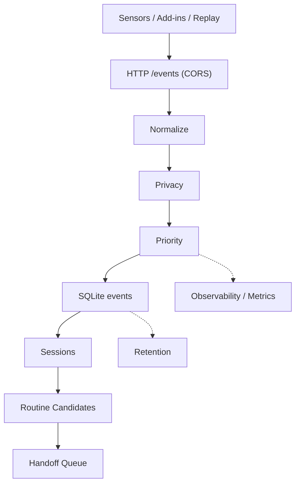

# Data-Collection-Projection
Minimal data collection pipeline that ingests JSON events, normalizes them,
applies privacy/priority rules, and stores rows in SQLite. It also builds
sessions, routine candidates, and handoff packages for downstream agents.

## Architecture


Key runtime signals:
- /health and /stats endpoints
- JSON line logs with 1-minute metrics snapshots
- retention cleanup logs

## Quick start (Windows + Conda)
```powershell
conda create -n DATA_C python=3.11.14 -y
conda activate DATA_C
python -m pip install --upgrade pip
pip install -r requirements.txt
```

Initialize the DB:
```powershell
python scripts\init_db.py
```

Run the core:
```powershell
$env:PYTHONPATH = "src"
python -m collector.main --config configs\config.yaml
```

Run a separate collection (run2 DB/logs):
```powershell
$env:PYTHONPATH = "src"
python -m collector.main --config configs\config_run2.yaml
```

Run a separate collection (run3 DB/logs):
```powershell
$env:PYTHONPATH = "src"
python -m collector.main --config configs\config_run3.yaml
```

## Send a test event (PowerShell)
```powershell
$body = @{
  schema_version="1.0"
  source="os"
  app="OS"
  event_type="os.app_focus_block"
  resource=@{type="window"; id="test_window"}
  payload=@{duration_sec=3; window_title="test_title"}
} | ConvertTo-Json -Depth 5

Invoke-RestMethod -Method Post -Uri "http://127.0.0.1:8080/events" `
  -ContentType "application/json" -Body $body
```

## OS sensors (Windows only)
Each sensor sends events to the same ingest endpoint.
```powershell
$env:PYTHONPATH = "src"
python -m sensors.os.windows_foreground --ingest-url "http://127.0.0.1:8080/events" --poll 1
```

```powershell
$env:PYTHONPATH = "src"
python -m sensors.os.windows_idle --ingest-url "http://127.0.0.1:8080/events" --idle-threshold 10 --poll 1
```

```powershell
$env:PYTHONPATH = "src"
python -m sensors.os.file_watcher --ingest-url "http://127.0.0.1:8080/events" --paths "C:\collector_test"
```

## Replay events (sensor-free)
```powershell
python scripts\replay_events.py --file tests\fixtures\sample_events_os_short.jsonl `
  --endpoint http://127.0.0.1:8080/events --speed fast
```

## Derived data jobs
Sessions:
```powershell
python scripts\build_sessions.py --since-hours 6 --gap-minutes 15
```

Routine candidates:
```powershell
python scripts\build_routines.py --days 1 --min-support 2 --n-min 2 --n-max 3
```

Handoff package:
```powershell
python scripts\build_handoff.py --keep-latest-pending
```

Optional crash-safe cursors:
```powershell
python scripts\build_sessions.py --use-state --gap-minutes 15
python scripts\build_routines.py --use-state --min-support 2 --n-min 2 --n-max 3
```

## Service / Task Scheduler (Windows)
Run the core via PowerShell script:
```powershell
scripts\run_core.ps1 -CondaEnv DATA_C -ConfigPath configs\config.yaml
```

Install Task Scheduler entry:
```powershell
scripts\install_service.ps1 -TaskName DataCollector -CondaEnv DATA_C -Trigger Logon
```

Remove it later:
```powershell
scripts\uninstall_service.ps1 -TaskName DataCollector
```

## Logs and stats
Logs (JSON lines) live in `logs\collector.log` by default. The logger rotates
by size and keeps multiple files (`collector.log.1`, `collector.log.2`, ...).

Tail logs:
```powershell
Get-Content .\logs\collector.log -Tail 50 -Wait
```

Activity detail logs (run3):
```powershell
Get-Content .\logs\run3\activity_detail.log -Tail 50 -Wait
```

Stats endpoint:
```powershell
python scripts\print_stats.py
```

Health check:
```powershell
Invoke-RestMethod http://127.0.0.1:8080/health
```

## Allowlist recommendations
Build allowlist candidates from recent focus usage:
```powershell
python scripts\recommend_allowlist.py --days 3 --min-minutes 10 --min-blocks 3
```

Apply to `configs\privacy_rules.yaml` (auto-backup created):
```powershell
python scripts\recommend_allowlist.py --days 3 --min-minutes 10 --min-blocks 3 --apply
```

## On-demand window title lookup (debug)
Query focus block titles from the DB when needed (no log noise):
```powershell
python scripts\show_focus_titles.py --config configs\config_run2.yaml --since-hours 6 --local-time
```

## Activity details (app + title hint aggregation)
Aggregate per-app activity hints (requires activity_detail enabled):
```powershell
python scripts\show_activity_details.py --config configs\config_run2.yaml --order duration --limit 30
```

## Browser extension (Chrome / Whale)
For page-level browser activity (URL + title), load the extension:
- Chrome: open `chrome://extensions`, enable Developer mode, load unpacked
  from `browser_extension\`.
- Whale: open `whale://extensions`, enable Developer mode, load unpacked
  from `browser_extension\`, and set `BROWSER_APP = "WHALE.EXE"` in
  `browser_extension\background.js`.

## Config
Main config: `configs\config.yaml`
- ingest: host/port/token
- queue: in-memory size and shutdown drain time
- store: SQLite busy timeout and batch insert behavior
- retention: cleanup policies and vacuum thresholds
- logging: JSON log path and rotation

Privacy rules: `configs\privacy_rules.yaml`
- masking and hashing rules
- allowlist/denylist apps
- URL sanitization and redaction patterns

## File structure
```
C:\Data-Collection-Projection\
  configs\
    config.yaml                # runtime config (ingest, queue, store, retention, logging)
    config_run2.yaml           # separate DB/logs config for run2
    config_run3.yaml           # separate DB/logs config for run3
    privacy_rules.yaml         # masking/hashing/allowlist/denylist rules
    privacy_rules_run3.yaml    # run3 privacy rules (full URL allowed)
  browser_extension\
    manifest.json              # Chrome/Whale extension manifest
    background.js              # sends tab URL/title to /events
  migrations\
    001_init.sql               # events table
    002_sessions.sql           # sessions table
    003_routine_candidates.sql # routine_candidates table
    004_handoff_queue.sql      # handoff_queue table
    005_state.sql              # state cursors for crash-safe batch jobs
    006_activity_details.sql   # activity detail aggregation table
  scripts\
    init_db.py                 # run migrations
    replay_events.py           # replay jsonl to /events
    build_sessions.py          # build sessions from events
    build_routines.py          # build routine candidates
    build_handoff.py           # build handoff package and enqueue
    run_retention.py           # run retention once
    print_stats.py             # fetch /stats
    recommend_allowlist.py     # suggest allowlist apps from focus usage
    show_focus_titles.py       # on-demand focus title lookup
    show_activity_details.py   # aggregated app activity details
    run_allowlist_recommendation.ps1 # run allowlist recommendation (PowerShell)
    run_core.ps1               # start collector with conda
    install_service.ps1        # Task Scheduler installer
    uninstall_service.ps1      # Task Scheduler remover
  src\
    collector\
      main.py                  # HTTP ingest + worker threads
      bus.py                   # normalize/privacy/priority/DB insert pipeline
      normalize.py             # schema validation and normalization
      privacy.py               # hashing/masking/allowlist/denylist logic
      priority.py              # priority assignment + focus block debounce
      sessionizer.py           # session boundary logic
      features.py              # session summary features
      routine.py               # routine candidate builder
      handoff.py               # handoff package builder
      retention.py             # retention cleanup policy
      observability.py         # counters, gauges, /stats snapshot
      store.py                 # SQLite access helpers
      logging_.py              # JSON logging and rotation
      config.py                # config loader and dataclasses
    sensors\
      os\                      # Windows sensors (foreground, idle, file watcher)
  tests\
    fixtures\                  # jsonl fixtures for replay/tests
    test_privacy.py            # privacy behavior
    test_priority.py           # priority mapping
    test_replay_contract.py    # event contract tests
    test_sessionizer.py        # sessionization tests
    test_routine.py            # routine candidate tests
  logs\                         # runtime JSON logs (rotated)
  collector.db                  # SQLite database
  collector_run2.db             # SQLite database for run2
  collector_run3.db             # SQLite database for run3
  First_Logging.md              # first collection report
  Second_Logging.md             # second collection report
```

## Korean Version
이 프로젝트는 JSON 이벤트를 수집하고, 정규화/프라이버시/우선순위 규칙을 적용한 뒤
SQLite에 저장하는 미니 데이터 수집 파이프라인입니다. 또한 세션, 루틴 후보,
핸드오프 패키지를 생성해 후속 에이전트에 전달합니다.

### 아키텍처


핵심 런타임 신호:
- /health, /stats 엔드포인트
- 1분 단위 metrics JSON 로그
- retention 정리 로그

### 빠른 시작 (Windows + Conda)
```powershell
conda create -n DATA_C python=3.11.14 -y
conda activate DATA_C
python -m pip install --upgrade pip
pip install -r requirements.txt
```

DB 초기화:
```powershell
python scripts\init_db.py
```

코어 실행:
```powershell
$env:PYTHONPATH = "src"
python -m collector.main --config configs\config.yaml
```

run2 실행:
```powershell
$env:PYTHONPATH = "src"
python -m collector.main --config configs\config_run2.yaml
```

run3 실행:
```powershell
$env:PYTHONPATH = "src"
python -m collector.main --config configs\config_run3.yaml
```

### 테스트 이벤트 전송 (PowerShell)
```powershell
$body = @{
  schema_version="1.0"
  source="os"
  app="OS"
  event_type="os.app_focus_block"
  resource=@{type="window"; id="test_window"}
  payload=@{duration_sec=3; window_title="test_title"}
} | ConvertTo-Json -Depth 5

Invoke-RestMethod -Method Post -Uri "http://127.0.0.1:8080/events" `
  -ContentType "application/json" -Body $body
```

### OS 센서 (Windows 전용)
각 센서는 동일한 ingest 엔드포인트로 이벤트를 전송합니다.
```powershell
$env:PYTHONPATH = "src"
python -m sensors.os.windows_foreground --ingest-url "http://127.0.0.1:8080/events" --poll 1
```

```powershell
$env:PYTHONPATH = "src"
python -m sensors.os.windows_idle --ingest-url "http://127.0.0.1:8080/events" --idle-threshold 10 --poll 1
```

```powershell
$env:PYTHONPATH = "src"
python -m sensors.os.file_watcher --ingest-url "http://127.0.0.1:8080/events" --paths "C:\collector_test"
```

### 리플레이(센서 없이 이벤트 주입)
```powershell
python scripts\replay_events.py --file tests\fixtures\sample_events_os_short.jsonl `
  --endpoint http://127.0.0.1:8080/events --speed fast
```

### 파생 데이터 작업
세션:
```powershell
python scripts\build_sessions.py --since-hours 6 --gap-minutes 15
```

루틴 후보:
```powershell
python scripts\build_routines.py --days 1 --min-support 2 --n-min 2 --n-max 3
```

핸드오프 패키지:
```powershell
python scripts\build_handoff.py --keep-latest-pending
```

옵션: 크래시 세이프 커서:
```powershell
python scripts\build_sessions.py --use-state --gap-minutes 15
python scripts\build_routines.py --use-state --min-support 2 --n-min 2 --n-max 3
```

### 서비스 / Task Scheduler (Windows)
PowerShell 스크립트로 코어 실행:
```powershell
scripts\run_core.ps1 -CondaEnv DATA_C -ConfigPath configs\config.yaml
```

Task Scheduler 등록:
```powershell
scripts\install_service.ps1 -TaskName DataCollector -CondaEnv DATA_C -Trigger Logon
```

해제:
```powershell
scripts\uninstall_service.ps1 -TaskName DataCollector
```

### 로그/통계
기본 로그 위치: `logs\collector.log` (용량 기준 로테이션).

로그 보기:
```powershell
Get-Content .\logs\collector.log -Tail 50 -Wait
```

디테일 로그(run3):
```powershell
Get-Content .\logs\run3\activity_detail.log -Tail 50 -Wait
```

Stats 조회:
```powershell
python scripts\print_stats.py
```

Health 체크:
```powershell
Invoke-RestMethod http://127.0.0.1:8080/health
```

### allowlist 추천
```powershell
python scripts\recommend_allowlist.py --days 3 --min-minutes 10 --min-blocks 3
```

### 이벤트 타이틀 온디맨드 조회
```powershell
python scripts\show_focus_titles.py --config configs\config_run2.yaml --since-hours 6 --local-time
```

### 앱별 활동 힌트 집계
```powershell
python scripts\show_activity_details.py --config configs\config_run2.yaml --order duration --limit 30
```

### 브라우저 확장 (Chrome / Whale)
브라우저 페이지 단위 활동(URL + title)을 수집하려면 확장을 로드합니다.
- Chrome: `chrome://extensions` → 개발자 모드 → 압축해제된 확장 로드
  경로: `browser_extension\`
- Whale: `whale://extensions` → 개발자 모드 → 압축해제된 확장 로드
  `browser_extension\background.js`에서 `BROWSER_APP="WHALE.EXE"` 설정

### 설정
메인 설정: `configs\config.yaml`
- ingest: host/port/token
- queue: 인메모리 큐 크기와 종료 드레인 시간
- store: SQLite busy timeout 및 배치 insert
- retention: 정리 정책 및 vacuum 주기
- logging: 로그 파일/로테이션/타임존

프라이버시 규칙: `configs\privacy_rules.yaml`
- 마스킹/해시/allowlist/denylist
- URL 정리 및 redaction 패턴
