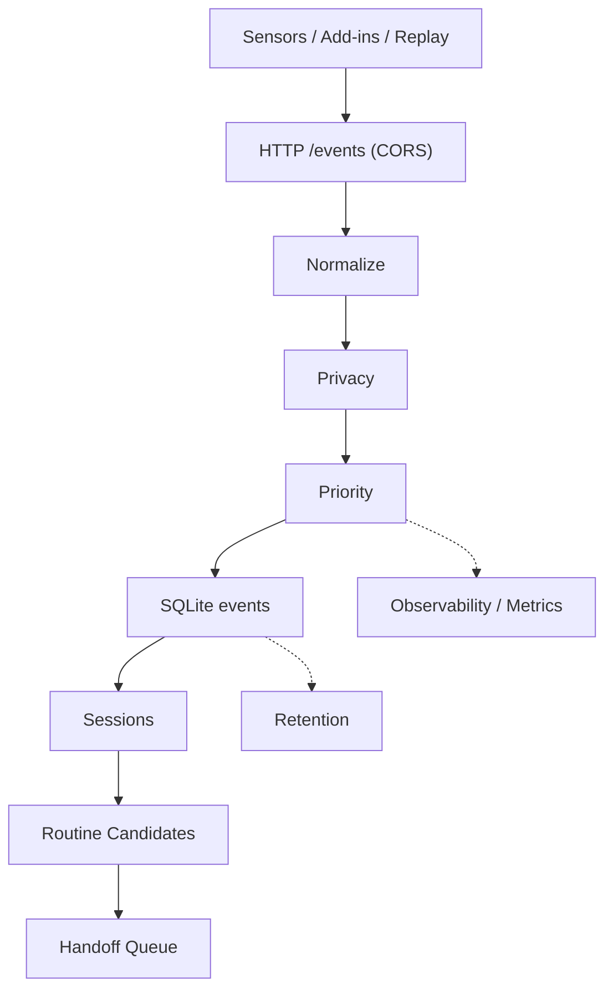

# Data-Collection-Projection
Minimal data collection pipeline that ingests JSON events, normalizes them,
applies privacy/priority rules, and stores rows in SQLite. It also builds
sessions, routine candidates, and handoff packages for downstream agents.

## Architecture


Key runtime signals:
- /health and /stats endpoints
- JSON line logs with 1-minute metrics snapshots
- retention cleanup logs

## Quick start (Windows + Conda)
```powershell
conda create -n DATA_C python=3.11.14 -y
conda activate DATA_C
python -m pip install --upgrade pip
pip install -r requirements.txt
```

Initialize the DB:
```powershell
python scripts\init_db.py
```

Run the core:
```powershell
$env:PYTHONPATH = "src"
python -m collector.main --config configs\config.yaml
```

Run a separate collection (run2 DB/logs):
```powershell
$env:PYTHONPATH = "src"
python -m collector.main --config configs\config_run2.yaml
```

Run a separate collection (run3 DB/logs):
```powershell
$env:PYTHONPATH = "src"
python -m collector.main --config configs\config_run3.yaml
```

Run a separate collection (run4 DB/logs):
```powershell
$env:PYTHONPATH = "src"
python -m collector.main --config configs\config_run4.yaml
```

Run a separate collection (run5 DB/logs):
```powershell
$env:PYTHONPATH = "src"
python -m collector.main --config configs\config_run5.yaml
```

Run run5 with auto key load:
```powershell
scripts\run_run5.ps1
```

Check browser content capture quality (run5):
```powershell
python scripts\check_content_capture.py --db collector_run5.db --key-path secrets\\collector_key.txt --limit 200
```

Auto-start sensors (optional, via config):
```yaml
sensors:
  auto_start: true
  processes:
    - module: sensors.os.windows_foreground
      args: ["--ingest-url","http://127.0.0.1:8080/events","--poll","1"]
    - module: sensors.os.windows_idle
      args: ["--ingest-url","http://127.0.0.1:8080/events","--idle-threshold","10","--poll","1"]
    - module: sensors.os.file_watcher
      args: ["--ingest-url","http://127.0.0.1:8080/events","--paths","C:\\collector_test"]
```

## Send a test event (PowerShell)
```powershell
$body = @{
  schema_version="1.0"
  source="os"
  app="OS"
  event_type="os.app_focus_block"
  resource=@{type="window"; id="test_window"}
  payload=@{duration_sec=3; window_title="test_title"}
} | ConvertTo-Json -Depth 5

Invoke-RestMethod -Method Post -Uri "http://127.0.0.1:8080/events" `
  -ContentType "application/json" -Body $body
```

## OS sensors (Windows only)
Each sensor sends events to the same ingest endpoint.
```powershell
$env:PYTHONPATH = "src"
python -m sensors.os.windows_foreground --ingest-url "http://127.0.0.1:8080/events" --poll 1
```

```powershell
$env:PYTHONPATH = "src"
python -m sensors.os.windows_idle --ingest-url "http://127.0.0.1:8080/events" --idle-threshold 10 --poll 1
```

```powershell
$env:PYTHONPATH = "src"
python -m sensors.os.file_watcher --ingest-url "http://127.0.0.1:8080/events" --paths "C:\collector_test"
```

## Replay events (sensor-free)
```powershell
python scripts\replay_events.py --file tests\fixtures\sample_events_os_short.jsonl `
  --endpoint http://127.0.0.1:8080/events --speed fast
```

## Derived data jobs
Sessions:
```powershell
python scripts\build_sessions.py --since-hours 6 --gap-minutes 15
```

Routine candidates:
```powershell
python scripts\build_routines.py --days 1 --min-support 2 --n-min 2 --n-max 3
```

Handoff package:
```powershell
python scripts\build_handoff.py --keep-latest-pending
```

Optional crash-safe cursors:
```powershell
python scripts\build_sessions.py --use-state --gap-minutes 15
python scripts\build_routines.py --use-state --min-support 2 --n-min 2 --n-max 3
```

## Summaries (daily → pattern → LLM input)
Daily summary:
```powershell
python scripts\build_daily_summary.py --config configs\config_run4.yaml --store-db
```

Pattern summary:
```powershell
python scripts\build_pattern_summary.py --summaries-dir logs\run4 --since-days 7 --config configs\config_run4.yaml --store-db
```

LLM input:
```powershell
python scripts\build_llm_input.py --config configs\config_run4.yaml --daily logs\run4\daily_summary_YYYY-MM-DD.json `
  --pattern logs\run4\pattern_summary.json --output logs\run4\llm_input.json --store-db
```

## Pattern quality evaluation
```powershell
python scripts\evaluate_pattern_quality.py --summaries-dir logs\run4 --output logs\run4\pattern_quality.json
```

## Mock data for pattern testing
Generate mock focus blocks:
```powershell
python scripts\generate_mock_events.py --days 7 --output tests\fixtures\mock_events_pattern.jsonl
```

Replay mock events:
```powershell
python scripts\replay_events.py --file tests\fixtures\mock_events_pattern.jsonl --endpoint http://127.0.0.1:8080/events --speed fast
```

## Cold archive (raw preservation)
Archive raw events:
```powershell
python scripts\archive_raw_events.py --config configs\config_run4.yaml --date 2026-01-28 --days 1 --output-dir archive\raw
```

Build manifest:
```powershell
python scripts\archive_manifest.py --archive-dir archive\raw --include-monthly --monthly-dir archive\monthly --output archive\manifest.json
```

Verify manifest:
```powershell
python scripts\verify_archive_manifest.py --manifest archive\manifest.json
```

Monthly compaction:
```powershell
python scripts\compact_archive_monthly.py --archive-dir archive\raw --output-dir archive\monthly --delete-after
```

Summary DB retention only:
```powershell
python scripts\retention_summary_only.py --config configs\config_run4.yaml
```

## Service / Task Scheduler (Windows)
Run the core via PowerShell script:
```powershell
scripts\run_core.ps1 -CondaEnv DATA_C -ConfigPath configs\config.yaml
```

Install Task Scheduler entry:
```powershell
scripts\install_service.ps1 -TaskName DataCollector -CondaEnv DATA_C -Trigger Logon
```

Remove it later:
```powershell
scripts\uninstall_service.ps1 -TaskName DataCollector
```

## Logs and stats
Logs (JSON lines) live in `logs\collector.log` by default. The logger rotates
by size and keeps multiple files (`collector.log.1`, `collector.log.2`, ...).

Tail logs:
```powershell
Get-Content .\logs\collector.log -Tail 50 -Wait
```

Activity detail logs (run3):
```powershell
Get-Content .\logs\run3\activity_detail.log -Tail 50 -Wait
```

Activity detail text logs (run3):
```powershell
Get-Content .\logs\run3\activity_detail.txt -Tail 50 -Wait
```

Stats endpoint:
```powershell
python scripts\print_stats.py
```

Health check:
```powershell
Invoke-RestMethod http://127.0.0.1:8080/health
```

## Allowlist recommendations
Build allowlist candidates from recent focus usage:
```powershell
python scripts\recommend_allowlist.py --days 3 --min-minutes 10 --min-blocks 3
```

Apply to `configs\privacy_rules.yaml` (auto-backup created):
```powershell
python scripts\recommend_allowlist.py --days 3 --min-minutes 10 --min-blocks 3 --apply
```

## On-demand window title lookup (debug)
Query focus block titles from the DB when needed (no log noise):
```powershell
python scripts\show_focus_titles.py --config configs\config_run2.yaml --since-hours 6 --local-time
```

## Activity details (app + title hint aggregation)
Aggregate per-app activity hints (requires activity_detail enabled):
```powershell
python scripts\show_activity_details.py --config configs\config_run2.yaml --order duration --limit 30
```

## Activity summary report
Summarize recent activity_details:
```powershell
python scripts\summarize_activity.py --config configs\config_run3.yaml --since-hours 24
```

## Pattern report (hourly)
Generate hourly usage patterns:
```powershell
python scripts\report_patterns.py --config configs\config_run4.yaml --since-days 3 --output reports\pattern_report.md
```

## Browser extension (Chrome / Whale)
For page-level browser activity (URL + title + optional content summary), load the extension:
- Chrome: open `chrome://extensions`, enable Developer mode, load unpacked
  from `browser_extension\`.
- Whale: open `whale://extensions`, enable Developer mode, load unpacked
  from `browser_extension\`, and set `BROWSER_APP = "WHALE.EXE"` in
  `browser_extension\background.js`.
URL mode is controlled in `browser_extension\background.js`:
- `URL_MODE = "full"` (full URL)
- `URL_MODE = "domain"` (domain only)
Content capture is controlled in `browser_extension\content.js`:
- `DOMAIN_ALLOWLIST` to restrict domains (use `["*"]` for all)
- content is sent as `content_summary` + `content` (full text), and full text is
  stored only in `raw_json` (run4 enables encryption by default; you can disable it).

## Config
Main config: `configs\config.yaml`
- ingest: host/port/token
- queue: in-memory size and shutdown drain time
- store: SQLite busy timeout and batch insert behavior
- encryption: optional at-rest encryption for raw_json (requires env key)
- retention: cleanup policies and vacuum thresholds
- logging: JSON log path, rotation, timezone
- privacy.url_mode: `rules` (use rules file), `full` (keep full URL), `domain` (store domain only)
- summary_db_path: optional separate SQLite file for summaries
- post_collection: optional automatic jobs (sessions/routines/handoff/summaries/LLM)

post_collection example:
```yaml
post_collection:
  enabled: true
  run_sessions: true
  run_routines: true
  run_handoff: true
  run_daily_summary: true
  run_pattern_summary: true
  run_llm_input: true
  run_pattern_report: true
  output_dir: logs/run5
  llm_max_bytes: 8000
  session_gap_minutes: 15
  routine_days: 7
  routine_min_support: 2
  routine_n_min: 2
  routine_n_max: 3
```

### Encryption (raw_json at rest)
Set an encryption key and enable in config (recommended for detailed content capture):
```powershell
# Generate a key
python -c "from cryptography.fernet import Fernet; print(Fernet.generate_key().decode())"

# Set env var for current PowerShell session
$env:DATA_COLLECTOR_ENC_KEY = "<paste_generated_key>"
```
Then enable in config (example in `configs\config_run4.yaml`):
```yaml
encryption:
  enabled: true
  key_env: DATA_COLLECTOR_ENC_KEY
  key_path: secrets/collector_key.txt  # optional file fallback
  encrypt_raw_json: true
```
To store the key in a file (auto-loaded if env is missing):
```powershell
mkdir secrets | Out-Null
python -c "from cryptography.fernet import Fernet; print(Fernet.generate_key().decode())" | `
  Set-Content secrets\collector_key.txt
```

Privacy rules: `configs\privacy_rules.yaml`
- masking and hashing rules
- allowlist/denylist apps
- URL sanitization and redaction patterns

## File structure
```
C:\Data-Collection-Projection\
  configs\
    config.yaml                # runtime config (ingest, queue, store, retention, logging)
    config_run2.yaml           # separate DB/logs config for run2
    config_run3.yaml           # separate DB/logs config for run3
    config_run4.yaml           # separate DB/logs config for run4
    config_run5.yaml           # separate DB/logs config for run5
    privacy_rules.yaml         # masking/hashing/allowlist/denylist rules
    privacy_rules_run3.yaml    # run3 privacy rules (full URL allowed)
    privacy_rules_run5.yaml    # run5 privacy rules
  browser_extension\
    manifest.json              # Chrome/Whale extension manifest
    background.js              # sends tab URL/title to /events
  migrations\
    001_init.sql               # events table
    002_sessions.sql           # sessions table
    003_routine_candidates.sql # routine_candidates table
    004_handoff_queue.sql      # handoff_queue table
    005_state.sql              # state cursors for crash-safe batch jobs
    006_activity_details.sql   # activity detail aggregation table
    007_summaries.sql          # summary tables (daily/pattern/llm)
  scripts\
    init_db.py                 # run migrations
    replay_events.py           # replay jsonl to /events
    build_sessions.py          # build sessions from events
    build_routines.py          # build routine candidates
    build_handoff.py           # build handoff package and enqueue
    build_daily_summary.py     # daily summary (optional DB storage)
    build_pattern_summary.py   # pattern summary (weekday/sequence)
    build_llm_input.py         # LLM input builder (size capped)
    evaluate_pattern_quality.py # pattern quality report
    generate_mock_events.py    # mock focus-block generator
    backfill_summaries.py      # backfill summary JSON into DB
    retention_summary_only.py  # retention for summary DB only
    run_retention.py           # run retention once
    print_stats.py             # fetch /stats
    recommend_allowlist.py     # suggest allowlist apps from focus usage
    show_focus_titles.py       # on-demand focus title lookup
    show_activity_details.py   # aggregated app activity details
    summarize_activity.py      # activity_details summary report
    report_patterns.py         # hourly pattern report
    archive_raw_events.py      # raw archive to jsonl.gz
    replay_archive_events.py   # replay archived events
    archive_manifest.py        # archive manifest (sha256)
    verify_archive_manifest.py # manifest verification
    compact_archive_monthly.py # merge daily into monthly
    archive_daily.ps1          # daily archive job
    install_archive_task.ps1   # schedule daily archive
    uninstall_archive_task.ps1 # remove daily archive task
    archive_monthly.ps1        # monthly compaction job
    install_archive_monthly_task.ps1  # schedule monthly compaction
    uninstall_archive_monthly_task.ps1 # remove monthly task
    run_allowlist_recommendation.ps1 # run allowlist recommendation (PowerShell)
    run_core.ps1               # start collector with conda
    run_run5.ps1               # start run5 with key auto-load
    install_service.ps1        # Task Scheduler installer
    uninstall_service.ps1      # Task Scheduler remover
  src\
    collector\
      main.py                  # HTTP ingest + worker threads
      bus.py                   # normalize/privacy/priority/DB insert pipeline
      normalize.py             # schema validation and normalization
      privacy.py               # hashing/masking/allowlist/denylist logic
      priority.py              # priority assignment + focus block debounce
      sessionizer.py           # session boundary logic
      features.py              # session summary features
      routine.py               # routine candidate builder
      handoff.py               # handoff package builder
      retention.py             # retention cleanup policy
      observability.py         # counters, gauges, /stats snapshot
      store.py                 # SQLite access helpers
      logging_.py              # JSON logging and rotation
      config.py                # config loader and dataclasses
    sensors\
      os\                      # Windows sensors (foreground, idle, file watcher)
  tests\
    fixtures\                  # jsonl fixtures for replay/tests
    test_privacy.py            # privacy behavior
    test_priority.py           # priority mapping
    test_replay_contract.py    # event contract tests
    test_sessionizer.py        # sessionization tests
    test_routine.py            # routine candidate tests
  logs\                         # runtime JSON logs (rotated)
  collector.db                  # SQLite database
  collector_run2.db             # SQLite database for run2
  collector_run3.db             # SQLite database for run3
  collector_run4.db             # SQLite database for run4 (raw)
  collector_summary_run4.db     # SQLite database for run4 (summaries)
  archive\                       # raw archive storage (jsonl.gz)
  First_Logging.md              # first collection report
  Second_Logging.md             # second collection report
```

## Korean Version
이 프로젝트는 JSON 이벤트를 수집하고, 정규화/프라이버시/우선순위 규칙을 적용한 뒤
SQLite에 저장하는 미니 데이터 수집 파이프라인입니다. 또한 세션, 루틴 후보,
핸드오프 패키지를 생성해 후속 에이전트에 전달합니다.

### 아키텍처


핵심 런타임 신호:
- /health, /stats 엔드포인트
- 1분 단위 metrics JSON 로그
- retention 정리 로그

### 빠른 시작 (Windows + Conda)
```powershell
conda create -n DATA_C python=3.11.14 -y
conda activate DATA_C
python -m pip install --upgrade pip
pip install -r requirements.txt
```

DB 초기화:
```powershell
python scripts\init_db.py
```

코어 실행:
```powershell
$env:PYTHONPATH = "src"
python -m collector.main --config configs\config.yaml
```

run2 실행:
```powershell
$env:PYTHONPATH = "src"
python -m collector.main --config configs\config_run2.yaml
```

run3 실행:
```powershell
$env:PYTHONPATH = "src"
python -m collector.main --config configs\config_run3.yaml
```

### 테스트 이벤트 전송 (PowerShell)
```powershell
$body = @{
  schema_version="1.0"
  source="os"
  app="OS"
  event_type="os.app_focus_block"
  resource=@{type="window"; id="test_window"}
  payload=@{duration_sec=3; window_title="test_title"}
} | ConvertTo-Json -Depth 5

Invoke-RestMethod -Method Post -Uri "http://127.0.0.1:8080/events" `
  -ContentType "application/json" -Body $body
```

### OS 센서 (Windows 전용)
각 센서는 동일한 ingest 엔드포인트로 이벤트를 전송합니다.
```powershell
$env:PYTHONPATH = "src"
python -m sensors.os.windows_foreground --ingest-url "http://127.0.0.1:8080/events" --poll 1
```

```powershell
$env:PYTHONPATH = "src"
python -m sensors.os.windows_idle --ingest-url "http://127.0.0.1:8080/events" --idle-threshold 10 --poll 1
```

```powershell
$env:PYTHONPATH = "src"
python -m sensors.os.file_watcher --ingest-url "http://127.0.0.1:8080/events" --paths "C:\collector_test"
```

센서를 따로 실행하지 않고 싶다면, config에 `sensors.auto_start`를 켜면
코어 실행 시 자동으로 센서 프로세스를 띄워줍니다.

If you prefer a single command, enable `sensors.auto_start` in the config and
the core will spawn these sensor processes automatically.

### 리플레이(센서 없이 이벤트 주입)
```powershell
python scripts\replay_events.py --file tests\fixtures\sample_events_os_short.jsonl `
  --endpoint http://127.0.0.1:8080/events --speed fast
```

### 파생 데이터 작업
세션:
```powershell
python scripts\build_sessions.py --since-hours 6 --gap-minutes 15
```

루틴 후보:
```powershell
python scripts\build_routines.py --days 1 --min-support 2 --n-min 2 --n-max 3
```

핸드오프 패키지:
```powershell
python scripts\build_handoff.py --keep-latest-pending
```

옵션: 크래시 세이프 커서:
```powershell
python scripts\build_sessions.py --use-state --gap-minutes 15
python scripts\build_routines.py --use-state --min-support 2 --n-min 2 --n-max 3
```

### 요약(일/패턴/LLM 입력)
```powershell
python scripts\build_daily_summary.py --config configs\config_run4.yaml --store-db
python scripts\build_pattern_summary.py --summaries-dir logs\run4 --since-days 7 --config configs\config_run4.yaml --store-db
python scripts\build_llm_input.py --config configs\config_run4.yaml --daily logs\run4\daily_summary_YYYY-MM-DD.json --pattern logs\run4\pattern_summary.json --output logs\run4\llm_input.json --store-db
```

### 패턴 품질 평가
```powershell
python scripts\evaluate_pattern_quality.py --summaries-dir logs\run4 --output logs\run4\pattern_quality.json
```

### Mock 데이터 패턴 테스트
```powershell
python scripts\generate_mock_events.py --days 7 --output tests\fixtures\mock_events_pattern.jsonl
python scripts\replay_events.py --file tests\fixtures\mock_events_pattern.jsonl --endpoint http://127.0.0.1:8080/events --speed fast
```

### Raw 아카이브(장기 보존)
```powershell
python scripts\archive_raw_events.py --config configs\config_run4.yaml --date 2026-01-28 --days 1 --output-dir archive\raw
python scripts\archive_manifest.py --archive-dir archive\raw --include-monthly --monthly-dir archive\monthly --output archive\manifest.json
python scripts\verify_archive_manifest.py --manifest archive\manifest.json
python scripts\compact_archive_monthly.py --archive-dir archive\raw --output-dir archive\monthly --delete-after
python scripts\retention_summary_only.py --config configs\config_run4.yaml
```

### 서비스 / Task Scheduler (Windows)
PowerShell 스크립트로 코어 실행:
```powershell
scripts\run_core.ps1 -CondaEnv DATA_C -ConfigPath configs\config.yaml
```

Task Scheduler 등록:
```powershell
scripts\install_service.ps1 -TaskName DataCollector -CondaEnv DATA_C -Trigger Logon
```

해제:
```powershell
scripts\uninstall_service.ps1 -TaskName DataCollector
```

### 로그/통계
기본 로그 위치: `logs\collector.log` (용량 기준 로테이션).

로그 보기:
```powershell
Get-Content .\logs\collector.log -Tail 50 -Wait
```

디테일 로그(run3):
```powershell
Get-Content .\logs\run3\activity_detail.log -Tail 50 -Wait
```

디테일 텍스트 로그(run3):
```powershell
Get-Content .\logs\run3\activity_detail.txt -Tail 50 -Wait
```

Stats 조회:
```powershell
python scripts\print_stats.py
```

Health 체크:
```powershell
Invoke-RestMethod http://127.0.0.1:8080/health
```

### allowlist 추천
```powershell
python scripts\recommend_allowlist.py --days 3 --min-minutes 10 --min-blocks 3
```

### 이벤트 타이틀 온디맨드 조회
```powershell
python scripts\show_focus_titles.py --config configs\config_run2.yaml --since-hours 6 --local-time
```

### 앱별 활동 힌트 집계
```powershell
python scripts\show_activity_details.py --config configs\config_run2.yaml --order duration --limit 30
```

### 브라우저 확장 (Chrome / Whale)
브라우저 페이지 단위 활동(URL + title + 선택적 content summary)을 수집하려면 확장을 로드합니다.
- Chrome: `chrome://extensions` → 개발자 모드 → 압축해제된 확장 로드
  경로: `browser_extension\`
- Whale: `whale://extensions` → 개발자 모드 → 압축해제된 확장 로드
  `browser_extension\background.js`에서 `BROWSER_APP="WHALE.EXE"` 설정
URL 모드는 `browser_extension\background.js`에서 설정:
- `URL_MODE = "full"` (전체 URL)
- `URL_MODE = "domain"` (도메인만)
콘텐츠 수집은 `browser_extension\content.js`에서 제어:
- `DOMAIN_ALLOWLIST`로 도메인 제한 (전체 수집은 `["*"]`)
- content는 `content_summary` + `content`로 전송되며, full content는
  `raw_json`에만 저장됨 (run4는 암호화 기본 ON, 필요 시 OFF 가능)

### 설정
메인 설정: `configs\config.yaml`
- ingest: host/port/token
- queue: 인메모리 큐 크기와 종료 드레인 시간
- store: SQLite busy timeout 및 배치 insert
- encryption: raw_json 저장 시 암호화(환경변수 키 필요)
- retention: 정리 정책 및 vacuum 주기
- logging: 로그 파일/로테이션/타임존
 - summary_db_path: 요약 전용 SQLite 파일 (raw DB 분리)

### 암호화 (raw_json at rest)
상세 내용 저장 시에는 raw_json 암호화를 권장합니다.
```powershell
# 키 생성
python -c "from cryptography.fernet import Fernet; print(Fernet.generate_key().decode())"

# 현재 세션 환경변수 설정
$env:DATA_COLLECTOR_ENC_KEY = "<생성된 키>"
```
`configs\config_run4.yaml` 예시:
```yaml
encryption:
  enabled: true  # 암호화 사용 시 true
  key_env: DATA_COLLECTOR_ENC_KEY
  key_path: secrets/collector_key.txt  # 환경변수 없을 때 파일 사용
  encrypt_raw_json: true
```
키를 파일에 저장해 자동 로드하려면:
```powershell
mkdir secrets | Out-Null
python -c "from cryptography.fernet import Fernet; print(Fernet.generate_key().decode())" | `
  Set-Content secrets\collector_key.txt
```

프라이버시 규칙: `configs\privacy_rules.yaml`
- 마스킹/해시/allowlist/denylist
- URL 정리 및 redaction 패턴
추가 옵션:
- privacy.url_mode: `rules`(기본), `full`(전체 URL 저장), `domain`(도메인만 저장)
